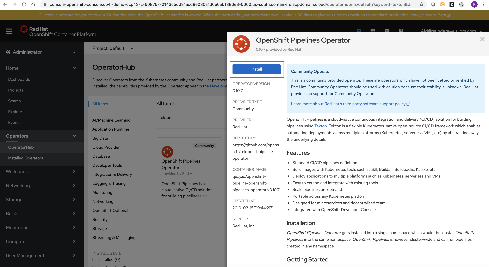
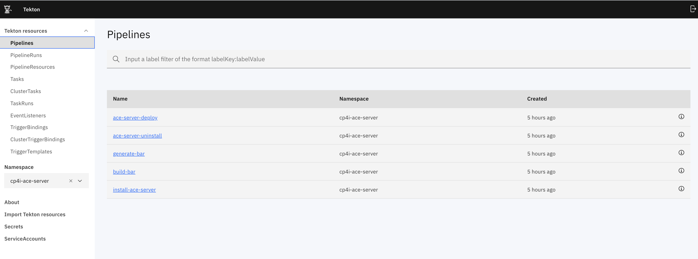
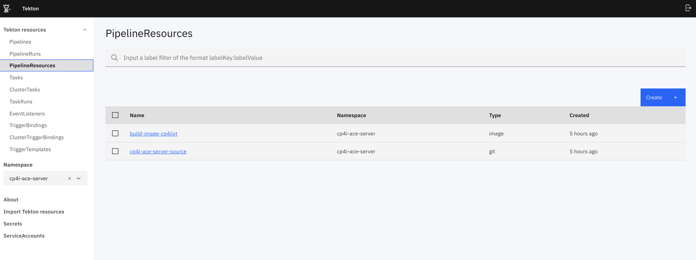
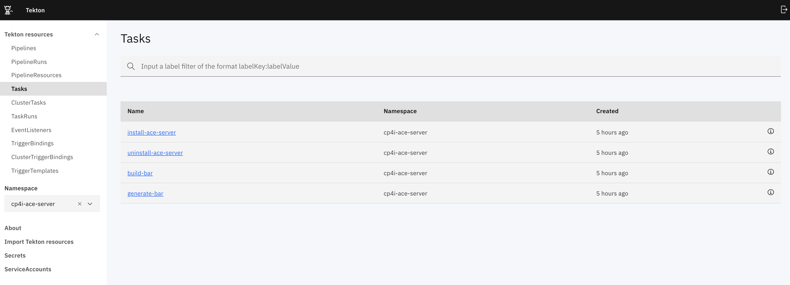
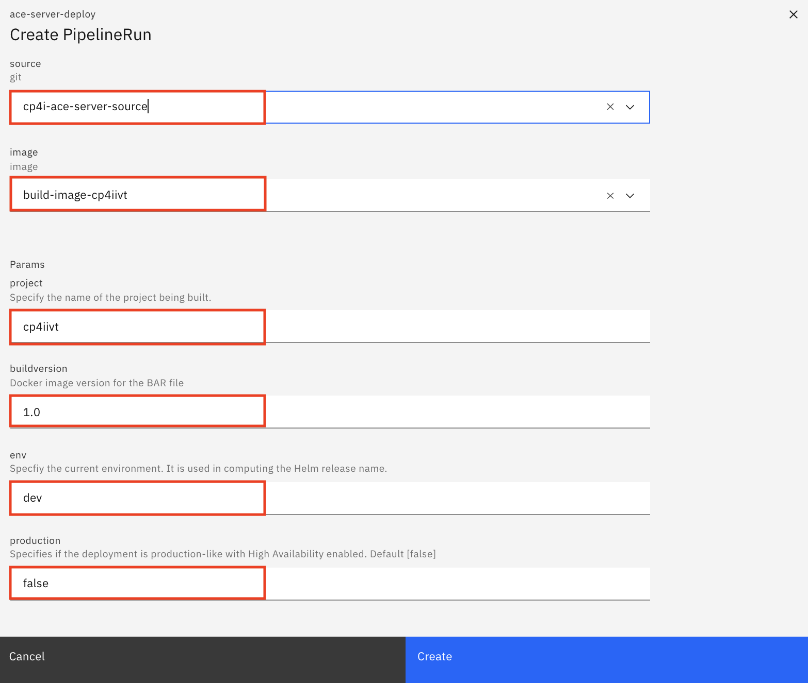
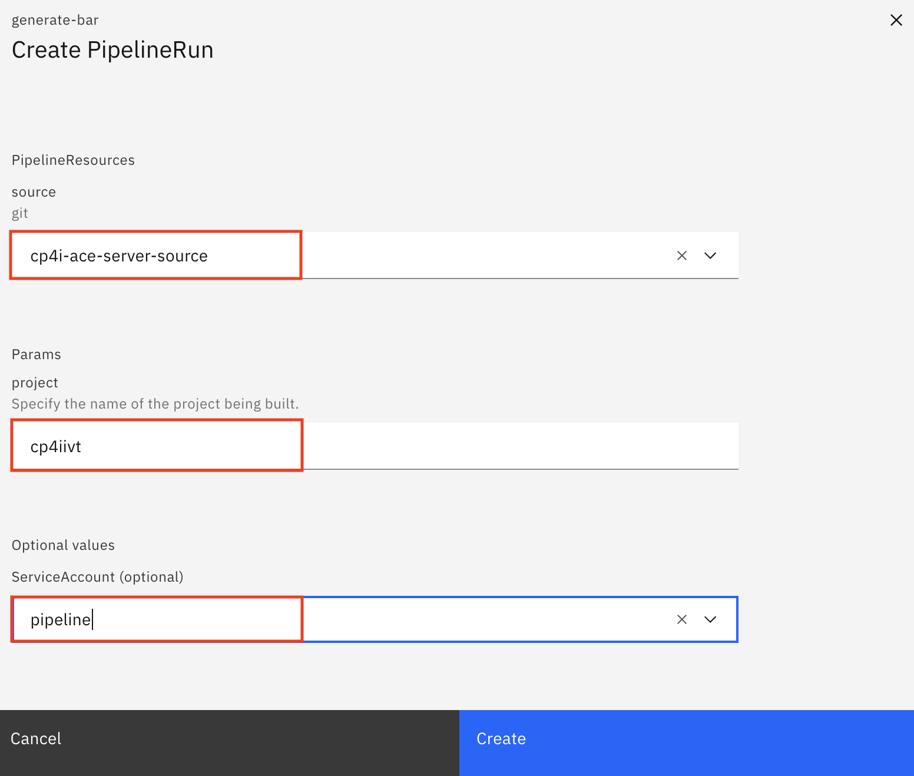
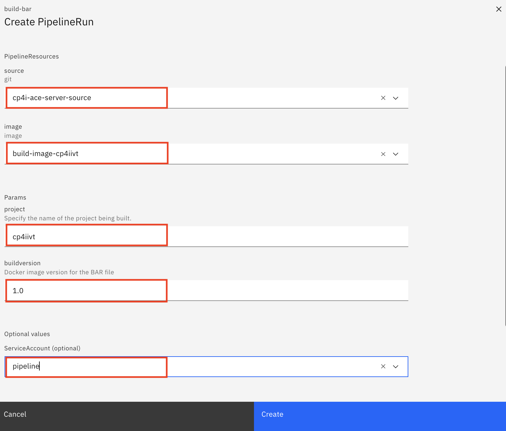
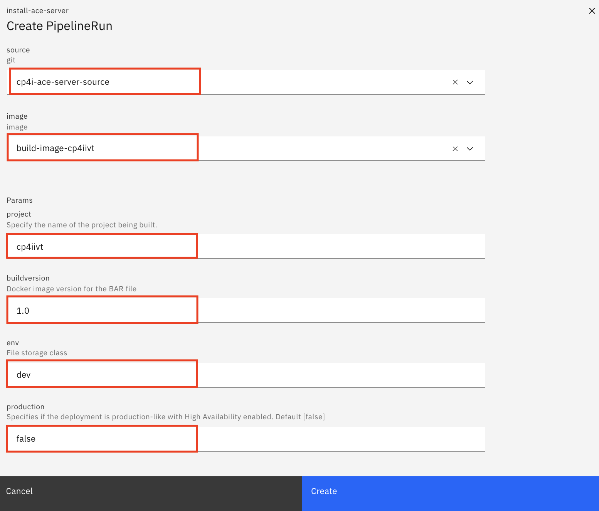
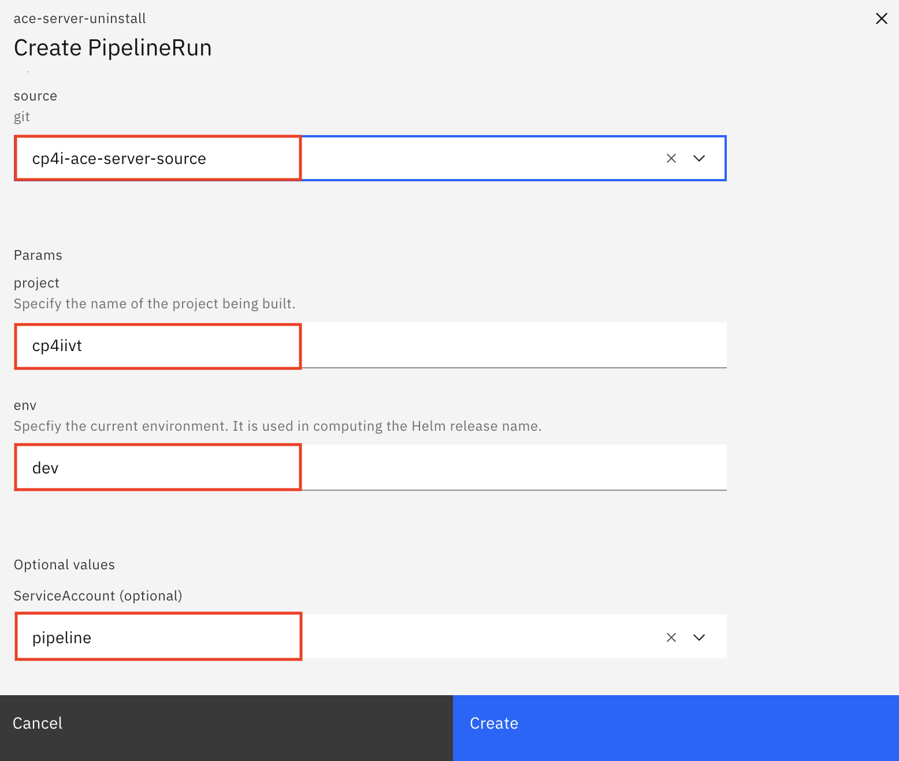

# Tekton piplines for enabling Continuos Integration to build and deploy ACE server instance

Tekton pipelines are now available to execute the following tasks in **Red Hat OpenShift Cluster Version 4.3**

- [Build and Deploy an ACE server instance](#31-pipeline-for-building-and-deploying-an-ace-server-instance)
   - [Step 1 - Generate a BAR file](#311-step-1---pipeline-for-generating-a-bar-file)
   - [Step 2 - Build an image with the BAR file](#312-step-2---pipeline-for-building-image-with-the-bar-file)
   - [Step 3 - Install an ACE server instance](#313-step-3---pipeline-for-installing-an-ace-server-instance)
- [Uninstall ACE server instance](#32-pipeline-for-uninstalling-an-ace-server-instance)


### 1. Pre-requisites

#### 1.1 Install OpenShift Pipelines Operator that uses Tekton.

Login to the OpenShift Cluster and using the Operator Hub, install the **OpenShift Pipelines Operator**.

 
 
#### 1.2 Install Tekton dashboard

The link [https://github.com/tektoncd/dashboard](https://github.com/tektoncd/dashboard) can used as reference to install Tekton dashboard. It includes the section for installing Tekton dashboard on OpenShift. The related commands are as follows:

```
oc new-project tekton-pipelines
kubectl apply --filename https://github.com/tektoncd/dashboard/releases/download/v0.5.3/openshift-tekton-dashboard-release.yaml --validate=false
```

The tekton dashboard is accessed using the following route: 

```
kubectl get route tekton-dashboard -n tekton-pipelines
```
 

### 2. Create Tekton resources

The script [createTektonResources.sh](./createTektonResources.sh) can be run to create the resources defined in the following manifests files. Also, the script [deleteTektonResources.sh](./deleteTektonResources.sh) can be run to delete the Tekton resources.

* [ace-server-secrets-template.yaml](./manifests/ace-server-secrets-template.yaml)
* [ace-server-resources.yaml](./manifests/ace-server-resources.yaml)
* [install-ace-server-task.yaml](./manifests/install-ace-server-task.yaml)
* [uninstall-ace-server-task.yaml](./manifests/uninstall-ace-server-task.yaml)
* [build-bar-task.yaml](./manifests/build-bar-task.yaml)
* [generate-bar-task.yaml](./manifests/generate-bar-task.yaml)
* [ace-server-deploy-pipeline.yaml](./manifests/ace-server-deploy-pipeline.yaml)
* [ace-server-uninstall-pipeline.yaml](./manifests/ace-server-uninstall-pipeline.yaml)
* [generate-bar-pipeline.yaml](./manifests/generate-bar-pipeline.yaml)
* [build-bar-pipeline.yaml](./manifests/build-bar-pipeline.yaml)
* [install-ace-server-pipeline.yaml](./manifests/install-ace-server-pipeline.yaml)


Note that the scripts are designed to create the Tekton resources in the project **cp4i-setup**

The contents of the script file [initConfig.sh](./initConfig.sh) needs to be updated to suit the environment.

```
#!/usr/bin/env bash

#
# The following section needs to be completed to match the environment 
#

# User name to access the common services 
COMMON_SERVICES_USERNAME=admin
# Credentials to access the common services 
COMMON_SERVICES_PASSWORD=xxx
# End point of the common services 
# Output of --> oc get routes -n kube-system | grep icp-console |  awk -F' ' '{print $2 }'
COMMON_SERVICE_ENDPOINT=icp-console.xxx

# cloudType is set to ibmcloud or onprem
CLOUD_TYPE=ibmcloud

# offLineInstall is set to true or false
OFFLINE_INSTALL=false

# fileStorage is set to "nfs" or "csi-cephfs" or "ibmc-file-gold" or "any RWX storage provider"
FILE_STORAGE=ibmc-file-gold

# Credentials to access git repository
# API Key can be created using the link --> https://help.github.com/en/github/authenticating-to-github/creating-a-personal-access-token-for-the-command-line
GIT_USER_NAME=xxx
GIT_API_KEY_OR_PASSWORD=xxx

# Credentials to access OpenShift Cluster
OPENSHIFT_CLUSTER_USERNAME=xxx
OPENSHIFT_CLUSTER_PASSWORD=xxx

#
# End of configuration
# 
```  

Once the script file [initConfig.sh](./initConfig.sh) is updated the script [createTektonResources.sh](./createTektonResources.sh) can be run to create Tekton resources.

Sample run is listed below:

```
$ ./createTektonResources.sh 
Now using project "cp4i-ace-server" on server "https://c100-e.us-south.containers.cloud.ibm.com:32108".

You can add applications to this project with the 'new-app' command. For example, try:

    oc new-app django-psql-example

to build a new example application in Python. Or use kubectl to deploy a simple Kubernetes application:

    kubectl create deployment hello-node --image=gcr.io/hello-minikube-zero-install/hello-node

secret/common-services created
secret/git-secret created
secret/docker-secret created
pipelineresource.tekton.dev/build-image-cp4iivt created
pipelineresource.tekton.dev/cp4i-ace-server-source created
task.tekton.dev/install-ace-server created
task.tekton.dev/uninstall-ace-server created
task.tekton.dev/build-bar created
task.tekton.dev/generate-bar created
pipeline.tekton.dev/ace-server-deploy created
pipeline.tekton.dev/ace-server-uninstall created
pipeline.tekton.dev/generate-bar created
pipeline.tekton.dev/build-bar created
pipeline.tekton.dev/install-ace-server created
```

Also, the service account **pipeline** must be updated to include the secrets as follows: 

```
oc project cp4i-ace-server
oc edit sa pipeline 
```

Update the service account info with the secrets **docker-secret** and **git-secret** as follows:

```

# Please edit the object below. Lines beginning with a '#' will be ignored,
# and an empty file will abort the edit. If an error occurs while saving this file will be
# reopened with the relevant failures.
#
apiVersion: v1
imagePullSecrets:
- name: pipeline-dockercfg-tqzjg
kind: ServiceAccount
metadata:
  creationTimestamp: "2020-04-05T15:24:16Z"
  name: pipeline
  namespace: cp4i-ace-server
  resourceVersion: "3282477"
  selfLink: /api/v1/namespaces/cp4i-ace-server/serviceaccounts/pipeline
  uid: 85cd6370-5076-4594-a8b5-f759a935e0a1
secrets:
- name: pipeline-token-4sl9c
- name: pipeline-dockercfg-tqzjg
- name: docker-secret
- name: git-secret
```

The following Tekton resources are created using the scripts.

#### 2.1 Tekton Pipelines

 
 
#### 2.2 Tekton Pipeline Resources 

 

#### 2.3 Tekton Tasks
 
 
 
 
### 3. Run Tekton Pipelines

Pipelines can be run to execute the tasks to setup the environment. When the pipelines are run it is required to run using the service account **pipeline**.

#### 3.1 Pipeline for Building and Deploying an ACE server instance

This pipeline perform the following three steps:

* Step 1 - Compile and Generate a new BAR file and check-in the generated BAR to the source repository
* Step 2 - Build a custom image that includes the generated BAR file and push it to OpenShift Registry
* Step 3 - Install an ACE server that uses the custom image having the newly built BAR file 

These steps can be run individually using the pipelines listed in [section 3.1.1](#311-step-1---pipeline-for-generating-a-bar-file), [section 3.1.2](#312-step-2---pipeline-for-building-image-with-the-bar-file) and [section 3.1.3](#313-step-3---pipeline-for-installing-an-ace-server-instance).

The parameters for running the pipeline to build and deploy an ACE server instance is listed below:

* **source** - Source having the scripts to perform the setup tasks. It is set to **cp4i-ace-server-source**
* **image** - The URL used for building the docker image. It is set to **build-image-cp4iivt**
* **project** - Specify the name of the project being built. It is set to **cp4iivt**
* **buildversion** - Specifies the build version of the ACE image. It is set to **9.0**
* **production** - Specifies if the deployment is production-like with High Availability enabled. It is set to **false**
* **env**  - Specifies the environment used for running pipeline. The value is used in computing the Helm release name. By default it is set to **dev**
* **ServiceAccount** - Specfies the Service Account to run the pipeline. It is set to **pipeline**

 


##### 3.1.1 Step 1 - Pipeline for generating a BAR file 

The parameters for running the pipeline to generate BAR file is listed below:

* **source** - Source having the scripts to perform the setup tasks. It is set to **cp4i-ace-server-source**
* **project** - Specify the name of the project being built. It is set to **cp4iivt**
* **ServiceAccount** - Specfies the Service Account to run the pipeline. It is set to **pipeline**

 


##### 3.1.2 Step 2 - Pipeline for building image with the BAR file

The parameters for running the pipeline to build image with the BAR file is listed below:

* **source** - Source having the scripts to perform the setup tasks. It is set to **cp4i-ace-server-source**
* **image** - The URL used for building the docker image. It is set to **build-image-cp4iivt**
* **project** - Specify the name of the project being built. It is set to **cp4iivt**
* **buildversion** - Specifies the build version of the ACE image. It is set to **9.0**
* **ServiceAccount** - Specfies the Service Account to run the pipeline. It is set to **pipeline**

 


##### 3.1.3 Step 3 - Pipeline for installing an ACE server instance

The parameters for running the pipeline to install an ACE server instance is listed below:

* **source** - Source having the scripts to perform the setup tasks. It is set to **cp4i-ace-server-source**
* **image** - The URL used for building the docker image. It is set to **build-image-cp4iivt**
* **project** - Specify the name of the project being built. It is set to **cp4iivt**
* **buildversion** - Specifies the build version of the ACE image. It is set to **9.0**
* **production** - Specifies if the deployment is production-like with High Availability enabled. It is set to **false**
* **env**  - Specifies the environment used for running pipeline. The value is used in computing the Helm release name. By default it is set to **dev**
* **ServiceAccount** - Specfies the Service Account to run the pipeline. It is set to **pipeline**

 
 

#### 3.2 Pipeline for uninstalling an ACE server instance

The parameters for running the pipeline to uninstall an ACE server instance is listed below:

* **source** - Source having the scripts to perform the setup tasks. It is set to **cp4i-ace-server-source**
* **project** - Specify the name of the project being built. It is set to **cp4iivt**
* **ServiceAccount** - Specfies the Service Account to run the pipeline. It is set to **pipeline**

 

